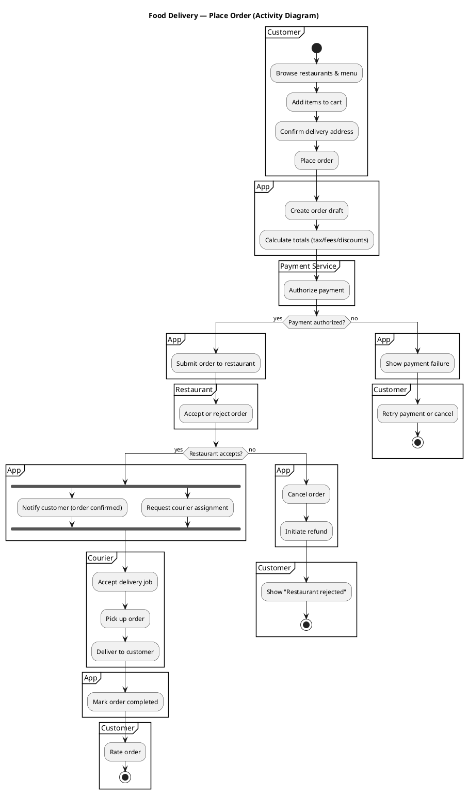

# UML Activity Diagrams — A Practical Guide (from Use Cases / SRS)

## 1) What an Activity Diagram is (and why you use it)

A **UML Activity Diagram** models the **workflow** of a system or business process as a sequence of **actions**, **decisions**, and **parallel flows**. It answers:

- **What happens next?** (control flow)
- **Who does what?** (responsibility via swimlanes/partitions)
- **What can happen in parallel?** (fork/join)
- **Where are the decision points and alternate paths?** (guards)
- **What are the end states and outcomes?** (final nodes)

### When Activity Diagrams are most useful
- Translating **Use Case main/alternate flows** into an executable-looking process model.
- Making an SRS less ambiguous by showing **ordering**, **branching**, **loops**, and **error handling**.
- Communicating behavior to developers/testers (happy path + edge cases).
- Designing APIs and services by clarifying **interaction order**.

### What Activity Diagrams are *not*
- They are not a data model (that’s Class/ER diagrams).
- They are not detailed message sequencing between objects (that’s Sequence diagrams).
- They are not a UI wireflow (though they can be aligned).

---

## 2) Core concepts (minimal mental model)

Think of an Activity Diagram as a directed graph:

- **Tokens** (conceptually) move along edges.
- An **action** runs when it receives a token.
- A **decision** chooses one outgoing edge based on a **guard** condition.
- A **fork** duplicates tokens for parallel execution; a **join** waits for all required tokens.

Key modeling questions:
- What is the **scope**? (single use case scenario, subsystem workflow, or end-to-end business process)
- What are **actors/roles** that perform steps? (partitions)
- What are **inputs/outputs**? (object/data flow — optional but helpful)

---

## 3) Standard UML symbols & notation (cheat sheet)

### Nodes
- **Initial node**: solid black circle — where the flow starts.
- **Action**: rounded rectangle — an atomic step (verb phrase).
- **Decision / Merge**: diamond — branch (decision) or reconverge (merge).
- **Fork / Join**: thick bar — split into parallel flows (fork) / synchronize (join).
- **Activity final**: bullseye (circle with dot) — ends the entire activity.
- **Flow final**: circle with X — ends only that path (other paths may continue).

### Edges
- **Control flow**: arrow showing execution order.
- **Object flow (data flow)**: arrow carrying data/object (optional; useful when you want to show what’s produced/consumed).

### Guards
- Written on outgoing edges from a decision node in square brackets, e.g.:
  - `[payment approved]`
  - `[else]`

### Partitions (Swimlanes)
- Vertical or horizontal lanes that show **who/what** performs each action:
  - Customer, Mobile App, Payment Service, Restaurant, Delivery Partner

### Events & exceptions (use sparingly)
- **Signals / Accept event / Send signal** can model asynchronous triggers.
- Many teams instead model exceptions as explicit branches:
  - `[payment failed] -> show error -> retry/cancel`

---

## 4) How to derive an Activity Diagram from Use Cases / SRS

### A) From a Use Case
Use cases usually include:
- Preconditions
- Main success scenario (basic flow)
- Alternative flows
- Exception flows
- Postconditions

Mapping rules (practical):
- **Each step** in the main success scenario → **Action**.
- “If … then … else …” → **Decision** with guarded edges.
- “User can repeat until …” → **Loop** using a decision/merge.
- “Do these in parallel” or “while this happens” → **Fork/Join**.
- Alternative/exception flows → **branches** that rejoin at a merge or terminate with flow final.

What to include vs. omit:
- Include business-relevant steps and system responsibilities.
- Omit UI micro-steps (e.g., “user clicks button”) unless you’re modeling a UI workflow.

### B) From an SRS
SRS sections that often map well:
- Functional requirements (“The system shall…”) → candidate actions.
- Business rules → guards/conditions.
- Non-functional requirements → usually annotations/notes, not control flow (except timeouts/retries).
- Error conditions → exception branches.

A reliable extraction approach:
1. List requirements in order of execution for a scenario.
2. Identify conditions (words like *if, unless, only if, when*).
3. Identify external systems/services mentioned (good swimlane candidates).
4. Identify concurrency keywords (*simultaneously, in parallel, while*).
5. Identify termination outcomes (success, failure, canceled).

---

## 5) Step-by-step process to create a good Activity Diagram

### Step 1 — Choose the scope
Pick *one* of these (don’t mix):
- **Use-case scenario diagram** (best for students): one use case + main & alternate flows.
- **End-to-end process**: spans multiple use cases.
- **Subsystem workflow**: internal logic of a component.

Write the scope as a title, e.g.:
- “Place Order (Food Delivery) — main + exceptions”

### Step 2 — Identify partitions (swimlanes)
Start small (3–6 lanes). Example lanes:
- Customer
- App
- Payment Service
- Restaurant
- Courier

Rule of thumb:
- A lane represents a **responsibility boundary** (actor, system, external service).

### Step 3 — Draft the main success flow first
- Put an initial node.
- Add actions in order.
- End with an activity final.

### Step 4 — Add decisions and guards
- For each “if/else” in your source artifact, add a decision.
- Name guards as **boolean conditions**.
- Always provide an `[else]` when practical.

### Step 5 — Add alternate/exception flows
- Add branches for failure cases.
- Decide whether failures **end the activity** (activity final) or **end only that path** (flow final).
- If you recover (retry), merge back into the main flow.

### Step 6 — Add parallelism (only if real)
- Add a fork when two flows truly proceed independently.
- Add a join when the process must wait for both.

### Step 7 — Review for clarity & correctness
Checklist:
- Every decision has guards.
- No “dangling” arrows.
- No huge actions that hide multiple decisions (split them).
- Naming uses consistent verb phrases.

---

## 6) Real-world example — Food Delivery: “Place Order”

Below is a single-use-case Activity Diagram (main flow + common exceptions). I’m using **PlantUML** text so you can render it easily.

### Example Use Case (compressed)
- Main flow: browse → add items → checkout → pay → restaurant confirms → courier assigned → delivery → complete.
- Alternate flows: payment failed; restaurant rejects; no courier available; customer cancels.

### PlantUML Activity Diagram

### How this maps to your artifacts
- Use case steps → actions like “Authorize payment”, “Submit order to restaurant”.
- Business rules → guards like “Payment authorized?” and “Restaurant accepts?”.
- Concurrency → fork between “notify customer” and “request courier assignment”.

---

## 7) Best practices (what instructors and teams look for)

- **Name actions as verb phrases**: “Validate payment”, “Reserve inventory”, “Send confirmation”.
- **Keep decisions explicit**: represent conditions as decision nodes with guards.
- **Use swimlanes for responsibility**: helps trace which actor/system is accountable.
- **Model outcomes**: show success end, failure end, cancellation end.
- **Prefer one diagram per use case** (or per scenario) over mega-diagrams.
- **Be consistent with abstraction level**: don’t mix “Click button” with “Run fraud detection” in the same diagram.

Practical quality check:
- If a tester can derive test cases (happy path + alternates) from the diagram, it’s at the right level.

---

## 8) Common mistakes (and how to avoid them)

- **Missing guards on decisions**
  - Fix: every outgoing edge from a decision should have `[condition]`, plus `[else]` when possible.

- **Using diamonds for everything**
  - Fix: diamonds are only for decision/merge. Use fork/join bars for parallelism.

- **Overcomplicating with implementation details**
  - Fix: avoid database table steps, UI widget details, or internal method calls unless the diagram’s scope is “internal component workflow”.

- **Unclear end conditions**
  - Fix: use activity final vs flow final intentionally; show distinct outcomes.

- **No merge after alternative flows**
  - Fix: if branches reconverge, use a merge node (diamond) before continuing.

- **Inconsistent lane usage**
  - Fix: if an action is done by a specific actor/service, place it in that lane.

---

## 9) Reliable learning resources (official + practical)

- **OMG UML Specification (official)**
  - Object Management Group UML overview/spec pages (look for UML 2.x Activity Diagrams).

- **PlantUML Activity Diagram docs (practical rendering)**
  - Great for quickly producing diagrams from text and version-controlling them.

- **diagrams.net (Draw.io) UML shapes**
  - Good for drag-and-drop UML activity diagram notation.

- **University/course notes from reputable institutions**
  - Search for “UML activity diagram lecture notes” from accredited universities; cross-check notation with the OMG spec.

---

## 10) Mini-template you can reuse for any Use Case

Use this as a checklist before drawing:

- **Title**: Use Case Name + scope (main + alternates?)
- **Partitions**: Actor(s) + System + External services
- **Main flow actions**: 6–15 actions
- **Decisions**: list conditions and guards
- **Alternate/exception flows**: what happens, does it rejoin, or does it end?
- **Parallelism**: where independent flows occur
- **Ends**: success + failure/cancel outcomes

If you want, paste one of your own use cases (main + alternate flows) and I’ll translate it into a clean Activity Diagram (PlantUML or Draw.io-ready structure).
