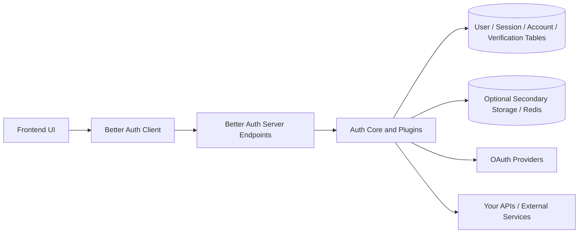

# Better Auth Overview

Better Auth is a framework-agnostic authentication and authorization framework for TypeScript applications. In practice, it gives you one auth core on the server, a matching client SDK for the frontend, a database-backed identity model, and a plugin system for advanced capabilities such as 2FA, passkeys, organizations, SSO, API keys, and JWT issuance.

## Authentication vs Authorization

These two concerns are related, but they solve different problems:

| Concern | Question | Better Auth role |
| --- | --- | --- |
| Authentication | "Who is this user?" | Sign-up, sign-in, session creation, social login, email/password, passkeys, MFA, account linking |
| Authorization | "What is this user allowed to do?" | Roles, permissions, organizations, teams, API keys, access-control checks |

The useful mental model is:

- Authentication establishes identity.
- Authorization evaluates permissions after identity is known.

Better Auth handles both, but not in the same way. Authentication is the core runtime. Authorization is mostly layered on top through plugins and application rules.

## Core Features

Main capabilities exposed by Better Auth include:

- Email and password authentication
- Social sign-in with built-in OAuth/OIDC providers
- Session and account management
- Multi-session and device/session revocation
- Two-factor authentication, passkeys, magic links, OTP, username login
- Organizations, teams, roles, and permissions
- Built-in rate limiting and security-oriented hooks
- Database schema generation/migration support
- Plugin ecosystem for extending auth behavior without rebuilding the stack

## High-Level Architecture

At a high level, Better Auth sits between your frontend, backend, and persistence layer:

The main moving parts are:

### 1. Server auth instance

You define an auth server with `betterAuth(...)`. This is the central configuration point for:

- authentication methods
- database adapter
- session strategy
- social providers
- plugins
- hooks and policy decisions

This server instance exposes auth endpoints and server-side APIs such as sign-in, session lookup, access checks, and account linking.

### 2. Client SDK

You create a matching client with `createAuthClient(...)`. The client is what your frontend calls for:

- sign up / sign in / sign out
- social OAuth redirects
- session retrieval
- reactive hooks such as `useSession`
- plugin-specific methods

The client is framework-aware on the frontend, while the core auth logic remains framework-agnostic.

### 3. Core data model

In database-backed mode, Better Auth centers around four core tables:

- `user`: profile and identity record
- `session`: active login sessions
- `account`: linked login methods such as password or OAuth provider accounts
- `verification`: email verification, reset, and other short-lived verification records

Plugins can add more tables or extend existing ones.

### 4. Session and token layer

Better Auth defaults to cookie-based sessions for browser applications, but can also issue JWTs and can run statelessly when needed.

### 5. Plugin layer

Most advanced features are installed as plugins on both the server and client. This is how Better Auth stays modular while still feeling integrated.

## Supported Authentication Strategies

### Sessions

Sessions are the default and recommended strategy for most modern web apps.

How they work:

- after sign-in, Better Auth creates a session record
- the session token is stored in a cookie
- the browser sends that cookie on later requests
- the server validates the session and returns user/session data

Important session capabilities:

- expiration and rolling refresh
- session freshness checks for sensitive actions
- session listing and revocation
- multi-device session management
- optional cookie caching to reduce database reads

Better Auth also supports stateless session mode. In that mode, session data is stored in signed or encrypted cookies so the server can validate sessions without querying a database on each request.

### JWT

JWT support exists, but it is not the default identity mechanism for browser apps.

The Better Auth JWT plugin is mainly for cases where another service needs a JWT and cannot use the browser session cookie. It provides:

- a `/token` endpoint to retrieve a JWT
- a `/jwks` endpoint so other services can verify the token
- configurable issuer, audience, subject, expiration, and payload
- key rotation and JWKS management

Important distinction:

- Sessions are the primary web-app auth mechanism.
- JWTs are an interoperability and service-to-service convenience layer.
- The docs explicitly position JWTs as a supplement to sessions, not a replacement for them in normal browser apps.

Better Auth also supports JWT-style cookie cache encoding for session caching, with `compact`, `jwt`, and `jwe` strategies.

### OAuth and Social Login

Better Auth has built-in support for OAuth 2.0 and OpenID Connect social providers such as Google, GitHub, Apple, Microsoft, Discord, and many others.

OAuth flow in Better Auth typically looks like this:

1. The frontend calls `signIn.social({ provider })`.
2. The user is redirected to the provider.
3. The provider sends the user back to Better Auth's callback endpoint.
4. Better Auth verifies the callback, creates or links the user/account, and creates a session.
5. The app receives the authenticated user through the normal session flow.

OAuth-related capabilities include:

- built-in provider support
- generic OAuth for unsupported providers
- account linking
- access-token retrieval and refresh
- custom scope requests
- mapping provider profiles to your local user schema
- additional data carried through the OAuth flow

## Authorization Model

Authentication answers identity. Authorization answers capability.

Better Auth's authorization story is strongest when you use its organization and access-control plugins.

Out of the box, the organization plugin supports:

- organizations
- members
- invitations
- teams
- active organization/team state in the session
- default roles such as `owner`, `admin`, and `member`
- permission checks through access-control helpers

It also supports custom roles and dynamic roles stored at runtime in the database.

This means Better Auth can cover common SaaS authorization patterns such as:

- user belongs to workspace
- workspace member has one or more roles
- roles imply permissions on resources and actions
- backend checks permission before allowing an operation

That said, application-specific authorization still belongs in your app. Better Auth provides the identity context, role model, and permission framework; your business rules still decide what a role actually means for your domain.

## Integration Flow in a Modern Application

The typical integration path looks like this:

### 1. Configure the server auth layer

Create an `auth.ts` server module with:

- `betterAuth(...)`
- database adapter or stateless configuration
- email/password and/or social providers
- session options
- plugins such as JWT, organization, 2FA, passkey, or API key

### 2. Create or migrate the schema

Better Auth provides CLI support to generate or migrate the required tables. Core tables are always needed in database mode, and plugins add their own schema requirements.

### 3. Expose auth endpoints

Your framework hosts Better Auth's server endpoints, commonly under a path such as `/api/auth`.

### 4. Create the frontend client

Create an `auth-client.ts` with `createAuthClient(...)`, pointing it at the auth server base URL and installing matching client plugins.

### 5. Authenticate users from the UI

From the frontend, call methods such as:

- `signUp.email(...)`
- `signIn.email(...)`
- `signIn.social(...)`
- `signOut()`

### 6. Read session state everywhere

Use:

- `useSession()` or `getSession()` on the client
- `auth.api.getSession({ headers })` on the server

This gives both the frontend and backend a shared view of the authenticated user.

### 7. Enforce authorization in backend logic

Your application checks the user's organization role, permissions, or custom rules before allowing actions like reading data, editing records, inviting members, or calling admin-only endpoints.

### 8. Issue JWTs only when another service needs them

If a downstream API, edge service, or separate microservice needs bearer credentials, use the JWT plugin to mint a token from the existing authenticated session.

## How the Pieces Connect

In a modern app, Better Auth usually connects the stack like this:

1. The user interacts with the frontend.
2. The frontend uses the Better Auth client SDK.
3. The client calls Better Auth server endpoints.
4. The server validates credentials or OAuth callbacks.
5. Better Auth stores or validates sessions using the database or stateless cookie mode.
6. The app reads the authenticated session on both client and server.
7. Authorization logic checks roles and permissions.
8. Optional plugins extend the same identity with 2FA, teams, API keys, JWTs, SSO, or passkeys.

This is the main reason Better Auth fits modern applications well: it keeps identity, session state, provider integration, and access-control primitives in one coherent system instead of forcing you to combine many unrelated libraries.

## Practical Decision Guide

Use Better Auth sessions when:

- you are building a browser-based web app
- your frontend and backend are part of the same application boundary
- you want simple revocation and conventional session semantics

Use the JWT plugin when:

- another service needs a bearer token
- you need standard JWT/JWKS interoperability
- you want external verification without a database round trip

Use OAuth providers when:

- you want social sign-in or enterprise identity federation
- you need provider access tokens or account linking

Use authorization plugins when:

- your app has workspaces, organizations, teams, or role-based access
- permissions need to be checked consistently across frontend and backend

## Bottom Line

Better Auth is best understood as a full authentication core for TypeScript apps with a strong authorization extension model.

- Authentication: sign users in, create sessions, link accounts, manage identity.
- Authorization: assign roles, manage organizations, and check permissions.
- Sessions: default and best fit for most web apps.
- JWTs: optional, mainly for interoperability and service-to-service use.
- OAuth: built-in and first-class for social and OIDC-style login.
- Architecture: one server auth core, one client SDK, one schema model, optional plugins layered on top.

That combination is what makes Better Auth feel "full-stack": the same system spans the frontend sign-in UX, backend session validation, data model, and access-control layer.