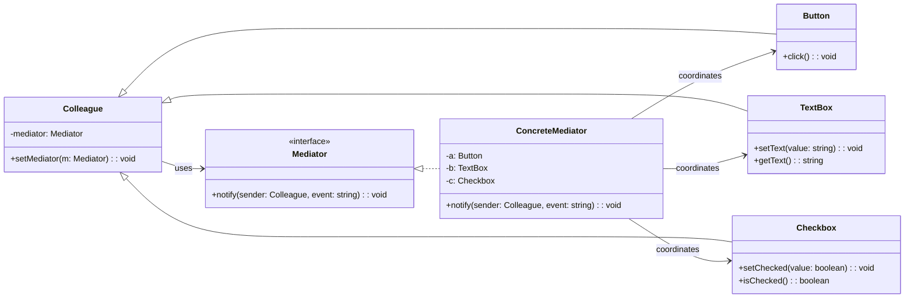

# Mediator Pattern

## 1. Definition
The **Mediator** pattern defines an object (the *mediator*) that encapsulates how a set of objects (*colleagues*) interact. Instead of colleagues referring to each other directly, they communicate through the mediator.

In other words: it **centralizes** communication logic so that colleagues become simpler and more reusable.

---

## 2. Intent (Goal of the pattern)
- Reduce **tight coupling** between a set of collaborating objects.
- Make object interaction easier to **change**, **extend**, and **reason about**.
- Keep colleagues focused on their own responsibilities by moving coordination logic to a mediator.

---

## 3. Problem it solves
When you have many objects that must coordinate, it’s tempting to let them call each other directly.

That quickly leads to:
- A “spaghetti” dependency graph (everything knows about everything).
- Changes in one component forcing changes in several others.
- Hard-to-test interaction logic scattered across multiple classes.

Mediator solves this by making colleagues depend on **one mediator** rather than on each other.

---

## 4. Motivation (real-world analogy if possible)
**Air traffic control (ATC)** is a classic analogy:
- Planes (colleagues) shouldn’t coordinate landing paths by calling each other.
- They talk to the control tower (mediator).
- The control tower coordinates landings and prevents conflicts.

This keeps planes simple and avoids plane-to-plane coupling.

---

## 5. Structure (explain the roles in the pattern)
Typical roles:

- **Mediator** (interface/abstract)
  - Declares how colleagues communicate (e.g., `notify(sender, event)`)

- **ConcreteMediator**
  - Implements coordination logic
  - Holds references to colleague instances

- **Colleague** (base type)
  - Knows about the mediator
  - Sends events/messages to the mediator

- **ConcreteColleagues**
  - Implement local behavior
  - Delegate collaboration logic to the mediator

Key idea: colleagues do **not** call each other directly.

---

## 6. UML diagram explanation
A common UML view:
- `ConcreteMediator` is connected to multiple `ConcreteColleague` types.
- Each `ConcreteColleague` has a reference to `Mediator`.
- Communication direction is *colleague → mediator → other colleagues*.

### Mermaid UML (class diagram)


---

## 7. Implementation example (preferably in TypeScript)
Example scenario: **Dialog form mediation**
- A checkbox “I agree” enables/disables a “Submit” button.
- A textbox must be non-empty to enable the “Submit” button.

Without Mediator: checkbox, textbox, and button would all reference each other.
With Mediator: they notify a `DialogMediator`, which applies the enabling/disabling logic.

```ts
// 1) Mediator contract
interface Mediator {
  notify(sender: Colleague, event: string): void;
}

// 2) Base colleague
abstract class Colleague {
  protected mediator?: Mediator;

  setMediator(mediator: Mediator) {
    this.mediator = mediator;
  }

  protected emit(event: string) {
    if (!this.mediator) {
      throw new Error("Mediator not set");
    }
    this.mediator.notify(this, event);
  }
}

// 3) Concrete colleagues
class TextBox extends Colleague {
  private value = "";

  setText(value: string) {
    this.value = value;
    this.emit("text:changed");
  }

  getText() {
    return this.value;
  }
}

class Checkbox extends Colleague {
  private checked = false;

  setChecked(value: boolean) {
    this.checked = value;
    this.emit("agree:changed");
  }

  isChecked() {
    return this.checked;
  }
}

class Button extends Colleague {
  private enabled = false;

  setEnabled(value: boolean) {
    this.enabled = value;
  }

  isEnabled() {
    return this.enabled;
  }

  click() {
    if (!this.enabled) {
      console.log("Submit blocked: button is disabled");
      return;
    }

    // In a real app, you might call a service here.
    console.log("Submitted!");
    this.emit("submit:clicked");
  }
}

// 4) Concrete mediator
class DialogMediator implements Mediator {
  constructor(
    private readonly nameInput: TextBox,
    private readonly agreeCheckbox: Checkbox,
    private readonly submitButton: Button,
  ) {
    this.nameInput.setMediator(this);
    this.agreeCheckbox.setMediator(this);
    this.submitButton.setMediator(this);

    // Initialize UI state
    this.syncSubmitState();
  }

  notify(sender: Colleague, event: string): void {
    switch (event) {
      case "text:changed":
      case "agree:changed":
        this.syncSubmitState();
        break;

      case "submit:clicked":
        // Example of coordinating additional behavior.
        // Keep the colleagues simple: business flow stays here.
        console.log("Mediator observed submission");
        break;

      default:
        // In a larger system you might use enums or typed events.
        console.log(`Unhandled event: ${event}`);
    }
  }

  private syncSubmitState() {
    const hasName = this.nameInput.getText().trim().length > 0;
    const agreed = this.agreeCheckbox.isChecked();
    this.submitButton.setEnabled(hasName && agreed);
  }
}

// --- demo usage ---
const nameInput = new TextBox();
const agree = new Checkbox();
const submit = new Button();
const dialog = new DialogMediator(nameInput, agree, submit);

submit.click(); // blocked
nameInput.setText("Ada");
submit.click(); // still blocked
agree.setChecked(true);
submit.click(); // Submitted!
```

---

## 8. Step-by-step explanation of the code
1. **`Mediator` interface** defines a single coordination entry point: `notify(sender, event)`.
2. **`Colleague` base class** stores a reference to the mediator and offers `emit(event)`.
3. **Concrete colleagues** (`TextBox`, `Checkbox`, `Button`) only manage their own state:
   - They *don’t* know about each other.
   - Whenever their state changes, they `emit(...)` an event.
4. **`DialogMediator`** wires colleagues together:
   - Sets itself as the mediator for each colleague.
   - Contains `syncSubmitState()` that decides whether submit should be enabled.
5. When a colleague changes:
   - `TextBox.setText(...)` emits `text:changed`.
   - `Checkbox.setChecked(...)` emits `agree:changed`.
   - The mediator reacts by recomputing UI state.

Result: adding new UI rules mainly changes the mediator, not every UI element.

---

## 9. Advantages
- **Looser coupling**: colleagues don’t depend on each other.
- **Single place for collaboration logic**: easier to understand interactions.
- **Improved reuse**: colleagues can be reused in different mediators.
- **Better testability**: you can test coordination logic by testing the mediator.

---

## 10. Disadvantages
- **Mediator can become too complex** (a “God object”) if many rules accumulate.
- Adds an extra abstraction layer (more types, more indirection).
- If events are untyped strings, you can lose compile-time safety.

---

## 11. When to use it
- Many objects interact in **complex but well-defined** ways.
- You want to reduce dependency tangles caused by object-to-object references.
- UI workflows (dialogs/forms/wizards), chat rooms, coordination services, orchestration logic.

---

## 12. When not to use it
- Interactions are simple (a direct call is clearer).
- Only two objects interact and the relationship is stable.
- Your mediator would become huge and unmaintainable (consider splitting or alternative architectures).

---

## 13. Real-world examples
- GUI frameworks: dialog mediators coordinating widgets.
- Chat rooms: users communicate via a chat room object.
- Workflow/orchestration: a coordinator service decides which component runs next.
- Game systems: event bus / coordinator managing interactions between subsystems (physics, UI, audio, etc.).

---

## 14. Related patterns
- **Observer**: often used inside a Mediator implementation (events/notifications).
- **Facade**: simplifies access to a subsystem, but doesn’t necessarily coordinate peer interactions.
- **Command**: UI actions can be represented as commands and triggered via a mediator.
- **Chain of Responsibility**: another way to route requests without tight coupling.

---

### Quick mental model
If you hear: “these components have too many references to each other”, Mediator is often the pattern you’re looking for.
