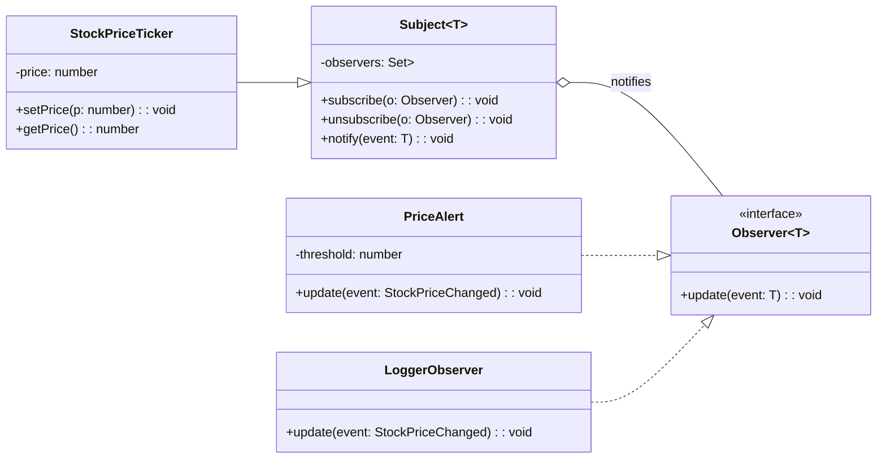

# Observer Pattern

## 1. Definition
The **Observer** pattern defines a **one-to-many dependency** between objects so that when one object (the *subject*) changes state, all its dependents (the *observers*) are **notified and updated automatically**.

In practice: a subject maintains a list of observers and broadcasts events/state changes to them.

---

## 2. Intent (Goal of the pattern)
- Let multiple objects react to changes in another object **without tight coupling**.
- Enable **event-driven** designs where new reactions can be added by registering observers.
- Support **publish/subscribe**-like behavior (in-process) while keeping the subject reusable.

---

## 3. Problem it solves
If an object needs to inform many others about changes, you might:
- Hard-code calls to each dependent (tight coupling), or
- Poll for changes (inefficient, delayed), or
- Create conditional logic that grows with each new dependent.

Observer solves this by letting dependents subscribe/unsubscribe dynamically, so the subject doesn’t need to know concrete types or how many listeners exist.

---

## 4. Motivation (real-world analogy if possible)
**YouTube channel subscriptions**:
- The channel (subject) publishes new videos.
- Subscribers (observers) get notified when a new video is posted.
- Subscribers can subscribe/unsubscribe at any time.

The channel doesn’t call each subscriber personally—it broadcasts to its subscriber list.

---

## 5. Structure (explain the roles in the pattern)
Typical roles:

- **Subject (Publisher)**
  - Maintains observer list
  - Provides `subscribe`, `unsubscribe`, and `notify`

- **Observer (Subscriber)**
  - Defines an update method (e.g., `update(data)`)

- **ConcreteSubject**
  - Has state
  - Calls `notify` when state changes

- **ConcreteObserver**
  - Reacts to notifications
  - Often stores a reference to the subject (optional)

Key idea: Subject depends only on the Observer interface, not concrete observers.

---

## 6. UML diagram explanation
In UML terms:
- `Subject` has a collection of `Observer`.
- Observers implement `update(...)`.
- When subject state changes, subject calls `observer.update(...)` for each observer.

### Mermaid UML (class diagram)


---

## 7. Implementation example (preferably in TypeScript)
Example scenario: **Stock price ticker**
- A `StockPriceTicker` publishes price changes.
- Observers react differently:
  - `LoggerObserver` logs every change.
  - `PriceAlert` triggers when price exceeds a threshold.

```ts
// Generic Observer contract
interface Observer<TEvent> {
  update(event: TEvent): void;
}

// Generic Subject base class
abstract class Subject<TEvent> {
  private readonly observers = new Set<Observer<TEvent>>();

  subscribe(observer: Observer<TEvent>): () => void {
    this.observers.add(observer);
    // Return an unsubscribe function (convenient in real apps)
    return () => this.unsubscribe(observer);
  }

  unsubscribe(observer: Observer<TEvent>) {
    this.observers.delete(observer);
  }

  protected notify(event: TEvent) {
    for (const observer of this.observers) {
      observer.update(event);
    }
  }
}

// Domain event (prefer typed events over strings)
type StockPriceChanged = {
  symbol: string;
  oldPrice: number;
  newPrice: number;
  changedAt: Date;
};

class StockPriceTicker extends Subject<StockPriceChanged> {
  private priceBySymbol = new Map<string, number>();

  setPrice(symbol: string, newPrice: number) {
    const oldPrice = this.priceBySymbol.get(symbol) ?? newPrice;
    this.priceBySymbol.set(symbol, newPrice);

    // Only notify if the price truly changed
    if (newPrice !== oldPrice) {
      this.notify({
        symbol,
        oldPrice,
        newPrice,
        changedAt: new Date(),
      });
    }
  }

  getPrice(symbol: string): number | undefined {
    return this.priceBySymbol.get(symbol);
  }
}

// Concrete observers
class LoggerObserver implements Observer<StockPriceChanged> {
  update(event: StockPriceChanged): void {
    console.log(
      `[${event.changedAt.toISOString()}] ${event.symbol}: ${event.oldPrice} -> ${event.newPrice}`,
    );
  }
}

class PriceAlert implements Observer<StockPriceChanged> {
  constructor(private readonly symbol: string, private readonly threshold: number) {}

  update(event: StockPriceChanged): void {
    if (event.symbol !== this.symbol) return;

    if (event.newPrice >= this.threshold) {
      console.log(
        `ALERT: ${event.symbol} crossed ${this.threshold} (now ${event.newPrice})`,
      );
    }
  }
}

// --- demo usage ---
const ticker = new StockPriceTicker();

const unsubscribeLogger = ticker.subscribe(new LoggerObserver());
const unsubscribeAlert = ticker.subscribe(new PriceAlert("MSFT", 500));

ticker.setPrice("MSFT", 480);
ticker.setPrice("MSFT", 510); // triggers alert

// Observers can detach
unsubscribeAlert();

ticker.setPrice("MSFT", 520); // alert is no longer triggered
unsubscribeLogger();
```

---

## 8. Step-by-step explanation of the code
1. `Observer<TEvent>` defines a single method: `update(event)`.
2. `Subject<TEvent>`:
   - Keeps a `Set` of observers.
   - Implements `subscribe`/`unsubscribe`.
   - Calls `notify(event)` to broadcast to all observers.
3. `StockPriceTicker` stores stock prices.
   - When `setPrice` changes a price, it constructs a typed event `StockPriceChanged`.
   - Calls `notify(...)` so all observers receive the event.
4. `LoggerObserver` reacts by logging.
5. `PriceAlert` reacts only for a specific symbol and threshold.
6. Subscribers can unsubscribe at runtime via the function returned by `subscribe`.

---

## 9. Advantages
- **Loose coupling**: subject doesn’t know concrete observers.
- **Open for extension**: add new observers without modifying the subject.
- **Supports event-driven design** naturally.
- Can improve separation of concerns: core state vs. reactions.

---

## 10. Disadvantages
- Notification order may be **undefined** (unless you enforce ordering).
- Can create **unexpected cascades** if observers trigger more changes.
- Potential for **memory leaks** if observers are not unsubscribed (common in UI apps).
- Harder to debug when many observers react to one event.

---

## 11. When to use it
- Many parts of the system must react to changes (UI updates, cache invalidation, audit logging).
- You want to add/remove reactions dynamically.
- You want to avoid polling.

---

## 12. When not to use it
- When a simple direct call is clearer (only one dependent, stable relationship).
- When you need strong ordering guarantees and the domain logic becomes fragile.
- When observers need complex coordination (consider **Mediator** or orchestration).

---

## 13. Real-world examples
- UI frameworks: views observe model changes.
- Domain events: publishing `OrderPlaced`, `UserRegistered`, etc. in-process.
- Logging/metrics: observers attach to business events.
- Cache invalidation: observers refresh derived data when source changes.

---

## 14. Related patterns
- **Mediator**: coordinates interactions between peers; Observer broadcasts state/events.
- **Publisher–Subscriber**: a more decoupled variant often involving a message broker/event bus.
- **Command**: observers can enqueue/execute commands in reaction to events.
- **State**: state transitions can notify observers.

---

### Quick mental model
If you hear: “when X changes, lots of things should react—but I don’t want X to know them”, Observer is usually the pattern.
