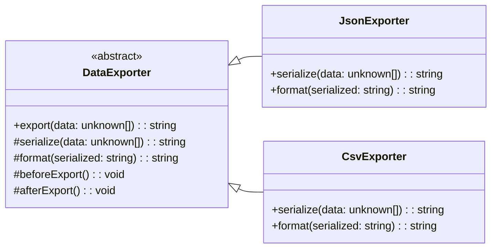

# Template Method Pattern

## 1. Definition
The **Template Method** pattern defines the **skeleton of an algorithm** in a base class method (the *template method*), while letting subclasses **override specific steps** of the algorithm without changing its overall structure.

In short: **“same workflow, customizable steps.”**

---

## 2. Intent (Goal of the pattern)
- Reuse a common algorithm structure across multiple variants.
- Allow controlled customization by overriding **well-defined hooks/steps**.
- Enforce invariants: keep the algorithm order consistent while varying details.

---

## 3. Problem it solves
When multiple implementations share a workflow but differ in a few steps, you often see:
- Copy/paste with small changes
- Condition-heavy code (switch/if ladders)
- Inconsistent order of operations across variants

Template Method solves this by centralizing the workflow in one place and pushing variation to subclasses.

---

## 4. Motivation (real-world analogy if possible)
**Cooking recipe template**:
- The recipe defines the overall procedure: prep → cook → plate.
- Different dishes change specific steps (spices, cooking time) but follow the same structure.

The structure stays stable; the variable steps change.

---

## 5. Structure (explain the roles in the pattern)
- **AbstractClass (Base class)**
  - Defines the **template method** (final-ish workflow)
  - Defines **primitive operations** (abstract methods) for steps that vary
  - Optionally defines **hooks** (default no-op or default behavior) that subclasses may override

- **ConcreteClass (Subclass)**
  - Implements/overrides the primitive operations and hooks to customize steps

Key idea: the base class controls the **algorithm order**.

---

## 6. UML diagram explanation
In UML:
- `AbstractClass` exposes `templateMethod()`.
- `templateMethod()` calls multiple step methods (`step1`, `step2`, `hook`, ...).
- `ConcreteClassA/B` override some steps to change behavior.

### Mermaid UML (class diagram)


---

## 7. Implementation example (preferably in TypeScript)
Example scenario: **Exporting data**
- The export workflow is always: `beforeExport` → `serialize` → `format` → `afterExport`.
- Different exporters serialize/format differently (JSON vs CSV).

```ts
abstract class DataExporter {
  // Template method: defines the algorithm skeleton
  export(data: unknown[]): string {
    this.beforeExport();

    const serialized = this.serialize(data);
    const result = this.format(serialized);

    this.afterExport();
    return result;
  }

  // Steps that must be provided by subclasses
  protected abstract serialize(data: unknown[]): string;
  protected abstract format(serialized: string): string;

  // Hooks (optional customization points)
  protected beforeExport(): void {
    // default: do nothing
  }

  protected afterExport(): void {
    // default: do nothing
  }
}

class JsonExporter extends DataExporter {
  protected serialize(data: unknown[]): string {
    return JSON.stringify(data);
  }

  protected format(serialized: string): string {
    // Pretty-print JSON for readability
    return JSON.stringify(JSON.parse(serialized), null, 2);
  }
}

class CsvExporter extends DataExporter {
  protected serialize(data: unknown[]): string {
    // Minimal demo: expects array of records with the same keys
    if (data.length === 0) return "";

    const first = data[0] as Record<string, unknown>;
    const headers = Object.keys(first);

    const escape = (value: unknown) => {
      const text = String(value ?? "");
      // Basic CSV escaping
      const escaped = text.replaceAll('"', '""');
      return /[",
]/.test(escaped) ? `"${escaped}"` : escaped;
    };

    const rows = data.map((row) => {
      const record = row as Record<string, unknown>;
      return headers.map((h) => escape(record[h])).join(",");
    });

    return [headers.join(","), ...rows].join("\n");
  }

  protected format(serialized: string): string {
    // Example: ensure newline at end (some tooling expects it)
    return serialized.length === 0 ? "" : serialized + "\n";
  }

  protected beforeExport(): void {
    // Example hook usage
    console.log("CSV export started");
  }

  protected afterExport(): void {
    console.log("CSV export finished");
  }
}

// --- demo usage ---
const records = [
  { id: 1, name: "Ada" },
  { id: 2, name: "Grace" },
];

const json = new JsonExporter().export(records);
console.log(json);

const csv = new CsvExporter().export(records);
console.log(csv);
```

---

## 8. Step-by-step explanation of the code
1. `DataExporter.export(...)` is the **template method**.
   - It defines the fixed order of operations.
   - It calls customizable steps.
2. `serialize(...)` and `format(...)` are **primitive operations**.
   - Subclasses must implement them.
3. `beforeExport()` and `afterExport()` are **hooks**.
   - They have defaults.
   - Subclasses may override them when needed.
4. `JsonExporter` customizes by:
   - Serializing via `JSON.stringify`
   - Formatting with pretty-printing
5. `CsvExporter` customizes by:
   - Implementing a simple CSV serializer
   - Using hooks to log start/finish

The workflow remains consistent across exporters while details differ.

---

## 9. Advantages
- **Reduces duplication**: common workflow lives in one place.
- **Enforces consistency**: algorithm order is centralized.
- **Controlled extensibility**: subclasses customize only intended steps.
- Often improves readability for families of similar algorithms.

---

## 10. Disadvantages
- Can increase inheritance usage (which some codebases prefer to minimize).
- Base class becomes a critical dependency; changes can affect many subclasses.
- Too many hooks/steps can make the design harder to follow.

---

## 11. When to use it
- You have multiple variants of a workflow with shared structure.
- You want to avoid copy/paste or complex conditionals.
- You need to keep a strict order of steps (validation → processing → cleanup).

Common areas:
- Import/export pipelines
- Build/deploy steps
- Parsing/processing workflows
- Authentication flows (e.g., validate → issue token → audit)

---

## 12. When not to use it
- Variations are better represented by **composition** rather than inheritance.
- The workflow changes frequently and differs drastically per variant.
- You need runtime selection of steps (Strategy may be better).

---

## 13. Real-world examples
- Framework lifecycle methods: e.g., web request handling pipelines where you override hooks.
- Test frameworks: setup → run test → teardown.
- Batch jobs: connect → read → transform → write → close.

---

## 14. Related patterns
- **Strategy**: swaps an algorithm via composition instead of inheritance.
- **Factory Method**: often used inside Template Method to create step-specific objects.
- **Hook methods** (concept): Template Method often relies on hooks.
- **Decorator**: extends behavior without changing the algorithm skeleton.

---

### Quick mental model
If you hear: “these classes follow the same steps, but one step differs”, Template Method is a strong candidate.
