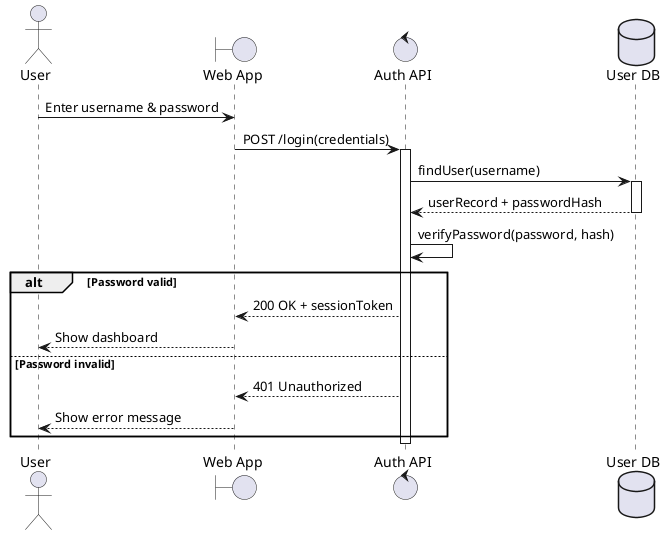
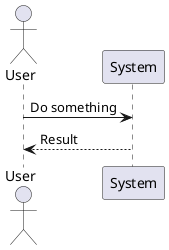
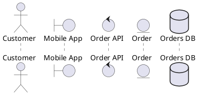
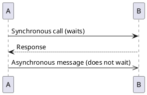
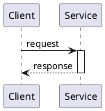
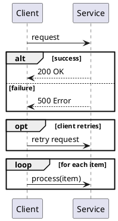
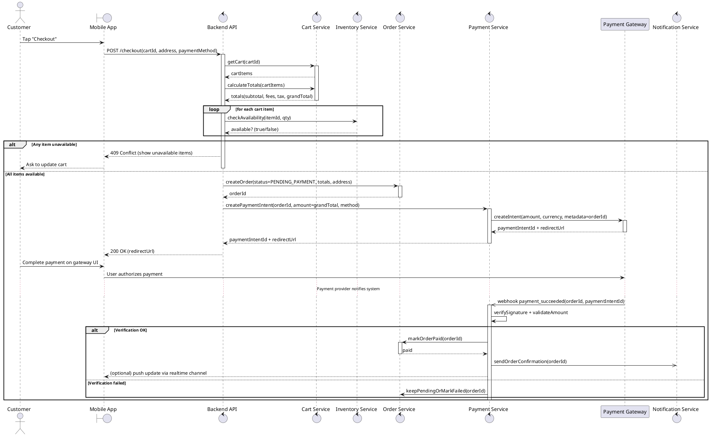

# UML Sequence Diagrams — Step-by-Step (Practical Guide)

This guide teaches you how to **write UML Sequence Diagrams** in a beginner-friendly, practical way. You’ll learn the parts, when to use them, how to write them in **PlantUML**, and how to create a complete diagram for a **Food Delivery System**.

---

## 1) Fundamentals

### 1.1 What is a Sequence Diagram?
A **Sequence Diagram** shows **how objects/people/systems interact over time** to complete a scenario.

- It focuses on **messages** (requests and responses)
- It shows **time order** from top → bottom
- It answers: **“Who talks to whom, in what order, and what can happen instead?”**

Think of it as a **movie script** of a single scenario.

### 1.2 When to use it (vs other diagrams)
Use a **Sequence Diagram** when you care about the *step-by-step interaction* between participants.

**Use Sequence Diagram when:**
- You want to design an API flow (request/response)
- You want to clarify responsibilities between services
- You need to handle “happy path” and “error paths” (payment fails, item out of stock, etc.)

**Use Case Diagram (instead) when:**
- You only want a *high-level view* of goals and actors
- You don’t care about internal message order

**Activity Diagram (instead) when:**
- You want to show the flow of actions/decisions, often within one system
- You care more about branching workflows than “who sent which message to whom”

**State Machine Diagram (instead) when:**
- You want to model lifecycle states (e.g., Order: Created → Paid → Preparing → PickedUp → Delivered)

**Rule of thumb:**
- **Use Case** = *what users want*
- **Activity** = *what steps happen*
- **Sequence** = *who talks to whom*
- **State** = *how an entity changes over time*

### 1.3 Key components (with quick intuition)

#### Actors
An **Actor** is an external user or system interacting with your system.

Examples:
- Customer
- Restaurant
- Payment Gateway (external)

In PlantUML you often write:
- `actor Customer`

#### Lifelines
A **Lifeline** is a participant over time (an actor, service, object, database).

Common lifelines in modern systems:
- UI/App
- Backend API
- Services (Payment, Order)
- Databases

In PlantUML you often write:
- `participant "Order Service" as OS`

#### Messages (sync vs async)
A **message** is a communication between lifelines.

- **Synchronous message**: sender waits for a result.
  - Example: API call that must return success/fail before continuing.
  - In PlantUML: `A -> B: request`

- **Asynchronous message**: sender does not wait.
  - Example: event published to a queue; fire-and-forget.
  - In PlantUML: `A ->> B: event`

#### Activation bars
An **activation bar** shows when a lifeline is actively doing work.

- It helps you visualize “who is executing now?”
- In PlantUML, activation bars can be automatic (or explicit):
  - `activate B`
  - `deactivate B`

#### Return messages
A **return message** represents a response.

- In PlantUML: `B --> A: response`

Note: In real diagrams, many teams omit explicit return arrows if it’s obvious. But for learning, it’s useful.

#### Combined fragments (alt, opt, loop)
Combined fragments let you model decisions and repetition clearly.

- `alt` = if/else
- `opt` = optional “if” without else
- `loop` = repeated behavior

In PlantUML:
- `alt condition` … `else other condition` … `end`
- `opt condition` … `end`
- `loop for each item` … `end`

---

## 2) Simple Example — User Login (Step-by-Step)

### 2.1 Scenario
A user logs in:
- User enters username/password
- System verifies credentials
- System returns success or failure

### 2.2 The diagram (PlantUML)

### 2.3 Explanation (each step)
1. **User → UI**: User inputs credentials.
2. **UI → API**: UI sends login request to backend.
3. **API activates**: Auth API starts processing.
4. **API → DB**: Auth API fetches user record.
5. **DB returns**: DB sends back stored password hash.
6. **API internal step**: Auth API checks password.
7. **alt fragment**:
   - If correct: return token and proceed.
   - Else: return 401 and show error.

Key learning: the `alt` block is how you show different outcomes cleanly.

---

## 3) Syntax Practice — Writing Sequence Diagrams in PlantUML

### 3.1 Minimal skeleton

What each line means:
- `@startuml` / `@enduml`: start/end markers
- `actor User`: declare an external actor
- `participant System`: declare a lifeline
- `User -> System: ...`: sync message
- `System --> User: ...`: return/response message

### 3.2 Participants: actor, boundary, control, entity, database
PlantUML supports UML-ish stereotypes to hint responsibility:

Line-by-line:
- `boundary`: UI / edge of system (screens, clients)
- `control`: coordination logic (services, controllers)
- `entity`: domain object (Order, Cart)
- `database`: data store

### 3.3 Sync vs async messages

Line-by-line:
- `->` means “call and wait”
- `->>` means “send and continue”

### 3.4 Activation bars (explicit)

Line-by-line:
- `activate Service`: show Service is running
- `deactivate Service`: Service finished

### 3.5 Combined fragments: alt, opt, loop

Line-by-line:
- `alt`/`else`/`end`: decision with two branches
- `opt`/`end`: optional branch
- `loop`/`end`: repeated steps

---

## 4) Apply to a Real Project — Food Delivery System (IMPORTANT)

We’ll use the **Checkout & Payment** use case because it naturally includes:
- multiple participants (customer, app, backend, payment provider)
- alternative outcomes (success/failure)
- loops (validate each cart item)

### 4.1 Use case (simple version)
**Use Case: Checkout & Payment**
- **Primary actor**: Customer
- **Goal**: Place an order and pay
- **Preconditions**: Cart has items; user is authenticated
- **Success**: Order is created and payment is confirmed
- **Failure**: Payment fails OR items become unavailable

### 4.2 User stories (examples)
1. As a customer, I want to **review my cart and total** so I can confirm what I’m buying.
2. As a customer, I want to **pay using card/UPI/wallet** so I can place the order.
3. As a customer, I want to **get immediate confirmation** when payment succeeds.
4. As a customer, I want to **see a clear error and retry** if payment fails.

### 4.3 Business rules (examples)
You can map business rules directly into fragments (`alt`, `opt`, `loop`) and validations:

- **BR1: Price must be recalculated server-side** at checkout (no trusting UI totals)
- **BR2: Item availability must be validated** before accepting payment
- **BR3: Order must be created as PENDING_PAYMENT** before contacting payment gateway
- **BR4: Payment confirmation must be verified** (e.g., via payment provider callback/webhook)
- **BR5: On payment failure, order stays unpaid and user can retry**

### 4.4 Identify participants (lifelines)
A realistic but still simple set:
- Customer (actor)
- Mobile App (UI)
- Backend API (entry point)
- Cart Service (cart + totals)
- Inventory Service (availability)
- Order Service (create order)
- Payment Gateway (external)
- Payment Service (internal verification + webhook handler)
- Notification Service (send receipt / confirmation)

### 4.5 Complete sequence diagram (PlantUML)

### 4.6 How the diagram maps from Use Case → Stories → Rules

#### A) From the Use Case
- “Customer taps checkout” becomes the first interaction: `Customer -> App`.
- “System validates cart and availability” becomes calls to `Cart` and `Inv`.
- “System creates order and processes payment” becomes calls to `Order`, then `Pay`, then `Payment Gateway`.
- “System confirms order” becomes marking paid + notifying customer.

#### B) From the User Stories
- Story: “Review my cart and total”
  - `getCart` + `calculateTotals` messages.
- Story: “Pay using card/UPI/wallet”
  - `createPaymentIntent` and gateway redirect.
- Story: “Get immediate confirmation”
  - `sendOrderConfirmation` and optional app update.
- Story: “Retry on payment failure”
  - The `alt` branches show failure/success; you can add an `opt Retry` block if you want to explicitly show retries.

#### C) From the Business Rules
- BR1 (recalculate totals server-side)
  - `calculateTotals` happens in backend flow, not trusted from UI.
- BR2 (validate availability)
  - `loop for each cart item` + `alt Any item unavailable`.
- BR3 (create order as pending before payment)
  - `createOrder(status=PENDING_PAYMENT, ...)` happens before contacting gateway.
- BR4 (verify via callback/webhook)
  - `PG ->> Pay: webhook payment_succeeded(...)` and `verifySignature + validateAmount`.
- BR5 (payment failure behavior)
  - Failure path inside `alt Verification failed`.

---

## 5) Best Practices (Keep it clear, not complex)

### 5.1 Keep diagrams readable
- **One diagram = one scenario** (e.g., “Checkout & Payment success/fail”).
- Prefer **5–9 lifelines**; split into multiple diagrams if you need more.
- Use **meaningful message names** like `createPaymentIntent(...)` instead of “process”.
- Use **combined fragments** (`alt`, `opt`, `loop`) instead of drawing separate diagrams for tiny variations.

### 5.2 Decide the level of detail
Pick a level and stick to it:
- **Business-level**: Customer, Restaurant, Delivery Partner (few internals)
- **Service-level**: Mobile App, Backend, Order Service, Payment Service
- **Code-level**: classes/objects, repositories, methods

Beginners should start at **service-level** (most useful for system design).

### 5.3 Common mistakes to avoid
- Mixing **multiple use cases** in one sequence diagram.
- Adding every micro-step (logging, metrics, cache) — it becomes noise.
- Not showing failure paths (payment fails, unavailable items).
- Confusing sync vs async:
  - If the caller needs the answer to continue, use `->`.
  - If it’s an event/notification, use `->>`.
- Leaving participants unnamed or inconsistent with your architecture.

### 5.4 Quick quality checklist
- Can a new teammate read it and explain the flow in 30 seconds?
- Are success and failure clearly separated with `alt`?
- Are important validations (rules) visible?
- Are responsibilities clear (UI vs API vs services)?

---

## 6) Your next practice (recommended)
Do this as a short exercise:

1. Pick a Food Delivery use case you know well (e.g., **Order Tracking**).
2. List participants (5–8 max).
3. Write the happy path as 8–12 messages.
4. Add one `alt` for a failure case (e.g., driver not assigned).
5. Add one `loop` (e.g., periodic location updates).

If you tell me which exact Food Delivery features you have (wallet? coupons? COD? scheduled delivery?), I can tailor the diagram to your rules and services.
