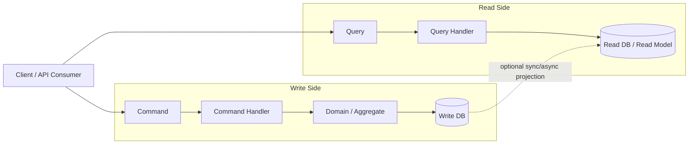
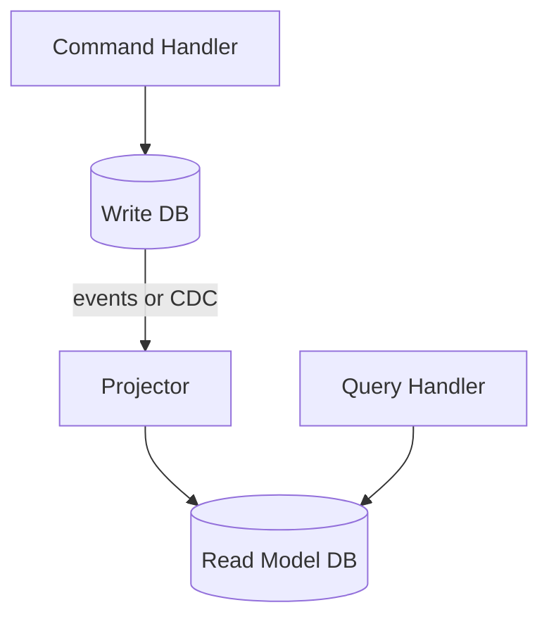
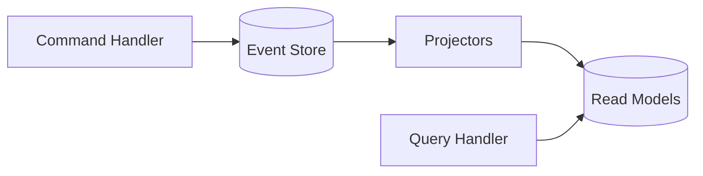

# CQRS (Command Query Responsibility Segregation) — Step-by-Step Learning Guide

> Date: 2026-03-17

## Part 0 — Prerequisites (quick context)
CQRS is an **architecture pattern**. It becomes most valuable when your application has:
- Complex business rules for writes (commands)
- High-read workloads and/or complex read projections
- Requirements like scalability, auditability, or multiple read views

For the code examples, I’ll assume:
- NestJS (TypeScript)
- The `@nestjs/cqrs` package (commonly used CQRS helpers)
- A simple domain: **Orders**

---

## Part 1 — What CQRS is (from scratch)

### Clear definition
**Simple explanation:**
CQRS means: **use different paths/models for writing data and reading data**. Writes are handled by *Commands*, reads by *Queries*.

**Technical definition:**
CQRS is a pattern that **segregates responsibility** between:
- a **Command side** (write model): validates and executes state changes (often domain-rich)
- a **Query side** (read model): optimized for returning data (often denormalized)

The key point is **separation of concerns**: reads and writes have different requirements, so you design them differently.

### The problem CQRS solves
In many CRUD systems, a single model and service must handle:
- business invariants and transactional writes
- read performance (filters, joins, aggregations)

This frequently leads to:
- “god” services, complicated conditional logic
- database schemas optimized for writes but slow for reads (or vice versa)
- difficulty scaling reads independently from writes

CQRS solves this by **splitting read and write responsibilities**.

### Architecture overview (with flow explanation)
**High-level flow:**
- **Commands**: “Do something” (change state) → return minimal info (e.g., `id`)
- **Queries**: “Give me something” (read state) → return DTOs/views



**Flow explanation:**
1. A request arrives.
2. If it changes state → it becomes a **Command**.
3. If it returns data without changes → it becomes a **Query**.
4. Command handler validates rules and writes to the write store.
5. Read side returns results from a read store optimized for queries.

### Code examples (TypeScript NestJS)

#### 1) Install and register CQRS module (typical)
```ts
// app.module.ts
import { Module } from '@nestjs/common';
import { CqrsModule } from '@nestjs/cqrs';

@Module({
  imports: [CqrsModule],
})
export class AppModule {}
```

#### 2) A simple command and handler
```ts
// create-order.command.ts
export class CreateOrderCommand {
  constructor(
    public readonly customerId: string,
    public readonly items: Array<{ sku: string; quantity: number }>
  ) {}
}
```

```ts
// create-order.handler.ts
import { BadRequestException, Inject } from '@nestjs/common';
import { CommandHandler, EventBus, ICommandHandler } from '@nestjs/cqrs';
import { CreateOrderCommand } from './create-order.command';
import { OrderCreatedEvent } from '../events/order-created.event';

// Write-side repository (talks to WRITE DB / transactional store)
export interface OrdersWriteRepository {
  createOrder(input: {
    orderId: string;
    customerId: string;
    items: Array<{ sku: string; quantity: number }>;
  }): Promise<void>;
}

export const ORDERS_WRITE_REPO = Symbol('ORDERS_WRITE_REPO');

@CommandHandler(CreateOrderCommand)
export class CreateOrderHandler implements ICommandHandler<CreateOrderCommand> {
  constructor(
    @Inject(ORDERS_WRITE_REPO)
    private readonly ordersWriteRepo: OrdersWriteRepository,
    private readonly eventBus: EventBus
  ) {}

  async execute(command: CreateOrderCommand): Promise<{ orderId: string }> {
    // 1) Validate command input (basic + domain-ish rules)
    if (!command.customerId?.trim()) {
      throw new BadRequestException('customerId is required');
    }
    if (!command.items?.length) {
      throw new BadRequestException('items must not be empty');
    }
    for (const item of command.items) {
      if (!item.sku?.trim()) {
        throw new BadRequestException('item.sku is required');
      }
      if (!Number.isInteger(item.quantity) || item.quantity <= 0) {
        throw new BadRequestException('item.quantity must be a positive integer');
      }
    }

    // 2) Generate id (in production: uuid, snowflake, DB sequence, etc.)
    const orderId = `order_${Date.now()}`;

    // 3) Persist to WRITE DB
    // In real code, this is typically transactional and touches multiple tables:
    // orders + order_items + outbox table, etc.
    await this.ordersWriteRepo.createOrder({
      orderId,
      customerId: command.customerId,
      items: command.items,
    });

    // 4) Publish domain event (for projections/integration)
    const totalItems = command.items.reduce((sum, i) => sum + i.quantity, 0);
    this.eventBus.publish(new OrderCreatedEvent(orderId, command.customerId, totalItems));

    // 5) Return minimal acknowledgement (don’t return large read DTO here)
    return { orderId };
  }
}
```

#### 3) A simple query and handler
```ts
// get-order.query.ts
export class GetOrderQuery {
  constructor(public readonly orderId: string) {}
}
```

```ts
// get-order.handler.ts
import { Inject, NotFoundException } from '@nestjs/common';
import { IQueryHandler, QueryHandler } from '@nestjs/cqrs';
import { GetOrderQuery } from './get-order.query';

// Read-side repository (talks to READ MODEL / projection store)
export interface OrdersReadRepository {
  findOrderViewById(orderId: string): Promise<
    | {
        id: string;
        customerId: string;
        status: 'CREATED' | 'PAID' | 'CANCELLED';
        totalItems: number;
        createdAt: string;
      }
    | null
  >;
}

export const ORDERS_READ_REPO = Symbol('ORDERS_READ_REPO');

@QueryHandler(GetOrderQuery)
export class GetOrderHandler implements IQueryHandler<GetOrderQuery> {
  constructor(
    @Inject(ORDERS_READ_REPO)
    private readonly ordersReadRepo: OrdersReadRepository
  ) {}

  async execute(query: GetOrderQuery): Promise<{
    id: string;
    customerId: string;
    status: 'CREATED' | 'PAID' | 'CANCELLED';
    totalItems: number;
    createdAt: string;
  }> {
    // IMPORTANT: Query handler reads from READ MODEL, not the write tables.
    // The read model is updated by projections (sync or async).
    const view = await this.ordersReadRepo.findOrderViewById(query.orderId);
    if (!view) {
      throw new NotFoundException('Order not found');
    }
    return view;
  }
}
```

#### 4) Wire it into a controller
```ts
// orders.controller.ts
import { Body, Controller, Get, Param, Post } from '@nestjs/common';
import { CommandBus, QueryBus } from '@nestjs/cqrs';
import { CreateOrderCommand } from './commands/create-order.command';
import { GetOrderQuery } from './queries/get-order.query';

@Controller('orders')
export class OrdersController {
  constructor(
    private readonly commandBus: CommandBus,
    private readonly queryBus: QueryBus
  ) {}

  @Post()
  create(@Body() body: { customerId: string; items: Array<{ sku: string; quantity: number }> }) {
    return this.commandBus.execute(new CreateOrderCommand(body.customerId, body.items));
  }

  @Get(':id')
  get(@Param('id') id: string) {
    return this.queryBus.execute(new GetOrderQuery(id));
  }
}
```

### Real-world use case
An e-commerce platform:
- **Write side**: create orders, apply discounts, reserve inventory, payments (complex rules)
- **Read side**: “My orders” list, order details, search, analytics views (read-heavy)

### Pros and cons
**Pros**
- Clear separation: write logic doesn’t get polluted by read concerns
- Read models can be optimized for performance and UX
- Easier to scale reads and writes independently (especially with separate stores)

**Cons**
- More moving parts (handlers, buses, read projections)
- Data duplication and synchronization (if separate read model)
- Operational complexity increases

---

## Part 2 — Command vs Query separation (go deeper)

### Clear definition
**Simple explanation:**
- A **Command** changes state.
- A **Query** returns state.

**Technical definition:**
- Commands represent **intent to mutate** an aggregate/system state and typically return **no data** (or minimal acknowledgement like an ID).
- Queries represent **read-only requests** and should have **no side effects**.

### The problem this separation solves
Without a strict separation, you often get:
- “reads” that accidentally mutate state (e.g., last-seen timestamps)
- “writes” that return huge graphs and start depending on read-optimized joins

CQRS encourages:
- Commands: validate, enforce invariants, write
- Queries: fetch, map to DTO, return

### Architecture overview (with flow explanation)
- **Command pipeline**: authorization → validation → domain invariants → persist → publish events
- **Query pipeline**: authorization → caching → read store → DTO mapping

A practical rule:
- If you need a response body, consider whether it’s a separate **Query** (read after write), rather than making the Command return a large DTO.

### Code examples (Typescript NestJS)

#### Example: command returns only ID; client then queries details
```ts
// command result
const { orderId } = await this.commandBus.execute(new CreateOrderCommand(customerId, items));

// read model fetch
const orderView = await this.queryBus.execute(new GetOrderQuery(orderId));
```

### Real-world use case
UI flow: “Create order” then redirect to “Order details” page.
- Command: create order
- Query: fetch order details view

### Pros and cons
**Pros**
- Reduces accidental side effects in reads
- Keeps write transactions focused and predictable

**Cons**
- Often requires two calls (command then query)

---

## Part 3 — Read model vs Write model (go deeper)

### Clear definition
**Simple explanation:**
- **Write model** is designed to safely change the system.
- **Read model** is designed to quickly answer questions.

**Technical definition:**
- The **write model** centers on aggregates/entities enforcing invariants and transactional consistency.
- The **read model** is a projection (materialized view) tailored for queries; it may be denormalized and designed for query patterns.

### The problem it solves
A normalized write schema is great for consistency, but can be slow for:
- lists, dashboards, filtering, search
- complex joins and aggregations

A read model can store exactly what the UI needs.

### Architecture overview (with flow explanation)
Two common variants:

1) **Single DB, separate models**
- Same database, but separate tables/views/queries for reads
- Lower operational overhead

2) **Separate read store**
- Write DB for commands (OLTP)
- Read DB (or cache/search index) for queries (optimized for read patterns)
- Requires replication/projections (event-driven or polling)



### Code examples (Typescript NestJS)
Below is a conceptual projector updating a read model when an event occurs.

```ts
// order-created.event.ts
export class OrderCreatedEvent {
  constructor(
    public readonly orderId: string,
    public readonly customerId: string,
    public readonly totalItems: number
  ) {}
}
```

```ts
// order-created.projector.ts
import { Inject } from '@nestjs/common';
import { EventsHandler, IEventHandler } from '@nestjs/cqrs';
import { OrderCreatedEvent } from './order-created.event';

// Read model writer (could be same DB different table, or a separate DB)
export interface OrdersViewWriteRepository {
  upsertOrderView(input: {
    id: string;
    customerId: string;
    status: 'CREATED' | 'PAID' | 'CANCELLED';
    totalItems: number;
    createdAt: Date;
  }): Promise<void>;
}

export const ORDERS_VIEW_WRITE_REPO = Symbol('ORDERS_VIEW_WRITE_REPO');

@EventsHandler(OrderCreatedEvent)
export class OrderCreatedProjector implements IEventHandler<OrderCreatedEvent> {
  constructor(
    @Inject(ORDERS_VIEW_WRITE_REPO)
    private readonly ordersViewWriteRepo: OrdersViewWriteRepository
  ) {}

  async handle(event: OrderCreatedEvent) {
    // This is where the READ MODEL gets updated.
    // If this runs async (message queue), the system becomes eventually consistent.
    await this.ordersViewWriteRepo.upsertOrderView({
      id: event.orderId,
      customerId: event.customerId,
      status: 'CREATED',
      totalItems: event.totalItems,
      createdAt: new Date(),
    });
  }
}
```

### Real-world use case
“Orders list page” needs a fast query by `customerId` with pagination and filters.
- Read model table `orders_view(customer_id, status, created_at, total_items, total_price)`
- Avoids expensive joins across many normalized write tables.

### Pros and cons
**Pros**
- Read performance and UI responsiveness improve dramatically
- Read model can be shaped per screen/use-case

**Cons**
- **Eventual consistency** if read model updates asynchronously
- Requires projection maintenance and backfills

---

## Part 4 — Event Sourcing (if related) — optional but common

### Clear definition
**Simple explanation:**
Instead of saving the latest state directly, you save **a sequence of events** (“OrderCreated”, “ItemAdded”, “OrderPaid”). Current state is derived by replaying events.

**Technical definition:**
Event Sourcing persists domain changes as an **append-only event stream**. Aggregates rebuild state by replaying events. CQRS often pairs with event sourcing because:
- commands produce events
- read models are projections of events

Important: **CQRS does not require Event Sourcing**. You can use CQRS with a normal write database.

### The problem it solves
- Complete audit trail (“what happened and when”)
- Time travel/debugging by replaying history
- Enables multiple projections (read models) from the same event stream

### Architecture overview (with flow explanation)
- Command handler validates and decides changes
- Instead of directly updating a row, it **appends events** to an event store
- Projections build read models from event streams



### Code examples (Typescript NestJS)
A minimal example showing an aggregate emitting events conceptually (simplified):

```ts
// order.aggregate.ts (simplified concept)
import { AggregateRoot } from '@nestjs/cqrs';
import { OrderCreatedEvent } from '../events/order-created.event';

export class OrderAggregate extends AggregateRoot {
  constructor(private readonly id: string) {
    super();
  }

  create(customerId: string, totalItems: number) {
    this.apply(new OrderCreatedEvent(this.id, customerId, totalItems));
  }
}
```

In a real event-sourced system, you’d also:
- Load the aggregate by replaying past events
- Persist newly produced events to an event store

### Real-world use case
Financial systems (payments/ledger):
- Strong need for auditability and traceability
- Multiple read views: statements, balances, compliance reports

### Pros and cons
**Pros**
- Strong audit history by design
- Easier to create new read models later by replaying events

**Cons**
- Higher complexity (event versioning, migrations, replay performance)
- Requires careful design of event schema and compatibility

---

## Practical guidance — When CQRS is worth it

### Good fits
- Complex domains (pricing, workflows, approvals)
- High read throughput vs write throughput
- Need different read views per client/screen
- Need audit logs / traceability

### Not great fits
- Simple CRUD apps with minimal rules
- Small projects where operational complexity is costly

---

## Next step (recommended learning path)
1. Start with **Command/Query separation in one NestJS module**.
2. Add **DTOs** and keep command results minimal.
3. Introduce a **read model table** for one screen (projection).
4. Only consider **event sourcing** after CQRS feels comfortable.

If you want, tell me what persistence you prefer for the examples (PostgreSQL + TypeORM, Prisma, or MongoDB), and I’ll extend this note with a fully working mini-module (entities, repositories, handlers, and module wiring).