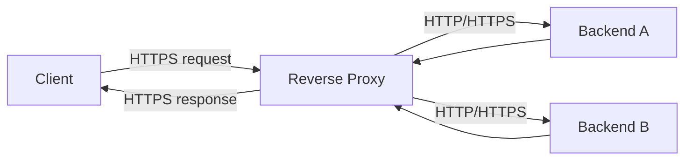
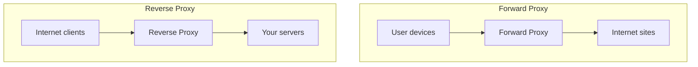

# Reverse Proxy — Concise & Practical Guide

> Date: 2026-03-17

## What is a Reverse Proxy?
**Simple explanation:**
A reverse proxy is a server that **sits in front of your backend servers** and **receives client requests on their behalf**, then forwards those requests to the appropriate backend.

**Technical definition:**
A reverse proxy is an **intermediary (L7/L4) gateway** that terminates client connections and **routes requests to upstream services**, often providing cross-cutting features such as **load balancing, TLS (SSL) termination, caching, rate limiting, and request filtering**.

---

## How it works (basic request/response flow)
1. Client sends request to the reverse proxy (e.g., `https://api.example.com`).
2. Reverse proxy chooses an upstream (one backend instance) based on rules (path/host) or load balancing.
3. Proxy forwards the request to the chosen backend.
4. Backend responds to proxy.
5. Proxy returns the response to the client.

### Flow chart


---

## Reverse Proxy vs Forward Proxy (short comparison)



**Quick comparison table:**

| Topic | Forward Proxy | Reverse Proxy |
|---|---|---|
| Who it represents | The **client** | The **server / service** |
| Typical location | Inside client network | In front of backend services |
| Common goal | Control outbound access, anonymity, content filtering | Protect/scale services, routing, TLS termination |
| Example | Corporate proxy for employee browsing | Nginx/HAProxy/Envoy in front of web/API |

---

## Common use cases
- **Load balancing**: spread traffic across many backend instances.
- **Security**: WAF rules, IP allow/deny, rate limiting, request size limits.
- **Caching**: cache static assets or API responses (when safe) to reduce backend load.
- **SSL/TLS termination**: handle HTTPS certificates at the edge, forward to backends over HTTP or internal TLS.

---

## Simple real-world example
You run `api.example.com` with 3 Node.js API servers.
- Clients connect to **one** public endpoint.
- Reverse proxy distributes requests across the 3 servers.
- If one server goes down, proxy routes around it.

---

## Basic configuration example

### Option A: Nginx (load balancing + reverse proxy)
```nginx
# /etc/nginx/conf.d/api.conf
upstream api_upstream {
  server 10.0.0.10:3000;
  server 10.0.0.11:3000;
  server 10.0.0.12:3000;
}

server {
  listen 80;
  server_name api.example.com;

  location / {
    proxy_pass http://api_upstream;

    # Forward useful headers
    proxy_set_header Host $host;
    proxy_set_header X-Real-IP $remote_addr;
    proxy_set_header X-Forwarded-For $proxy_add_x_forwarded_for;
    proxy_set_header X-Forwarded-Proto $scheme;
  }
}
```

### Option B: Node.js (very small reverse proxy)
Use when you want a quick demo or need custom logic. In production, a battle-tested proxy (Nginx/Envoy/HAProxy) is usually preferred.

```ts
// reverse-proxy.ts
import http from 'http';
import httpProxy from 'http-proxy';

const proxy = httpProxy.createProxyServer({});

const targets = [
  'http://localhost:3001',
  'http://localhost:3002',
  'http://localhost:3003',
];
let i = 0;

http
  .createServer((req, res) => {
    const target = targets[i % targets.length];
    i++;

    proxy.web(req, res, { target }, (err) => {
      res.statusCode = 502;
      res.end('Bad gateway');
    });
  })
  .listen(8080, () => {
    console.log('Reverse proxy listening on http://localhost:8080');
  });
```

---

## When should you use a reverse proxy in a real system?
Use one when you need **any** of the following:
- Multiple backend instances (scale out) → **load balancing**
- A single stable public endpoint while services change internally
- TLS cert management and HTTPS everywhere → **TLS termination**
- Centralized security controls (rate limiting, IP filtering, WAF)
- Caching/compression for performance

If you have a single small service and no special requirements, you might not need one yet.

---

## Pros and cons (brief)
**Pros**
- Simplifies clients: one endpoint
- Improves reliability and scalability
- Adds security and performance features without changing app code

**Cons**
- Extra component to deploy/monitor
- Misconfiguration can cause outages or security gaps
- Debugging adds a hop (need to check proxy + backend)
