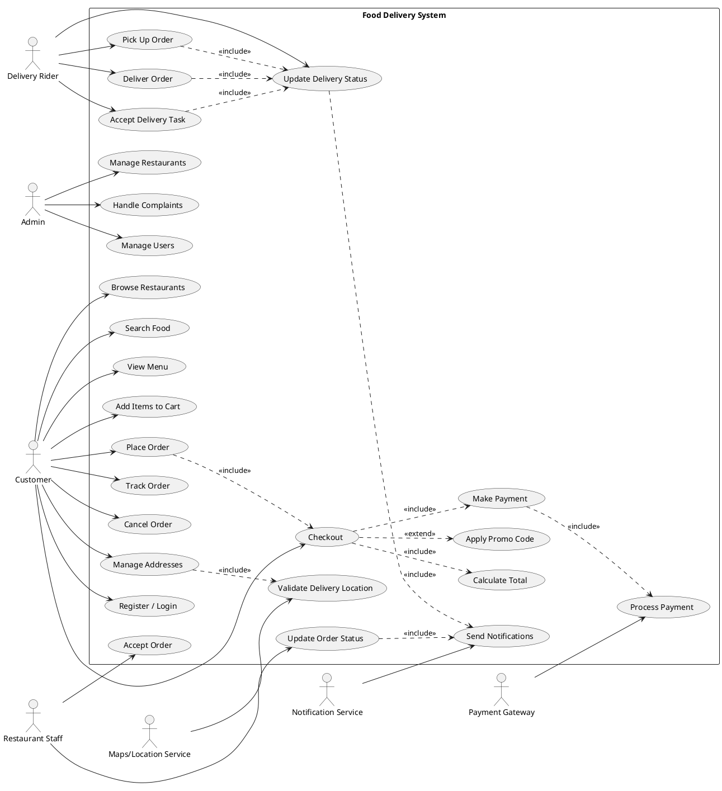

# Use Case Diagram (UML) — Step-by-step Guide (Food Delivery App)

## 1) Concept

### What is a Use Case Diagram?
A **Use Case Diagram** is a UML (Unified Modeling Language) diagram that shows:
- **Who** interacts with a system (**actors**), and
- **What goals** they achieve with the system (**use cases**),
- At a **high level** (it does not show algorithms, UI screens, or database tables).

Think of it as a **map of system functionality from a user’s perspective**.

### Purpose in the SDLC
Use Case Diagrams are mainly used in:
- **Requirements & Analysis**: clarify scope, users, and main features.
- **Communication**: align understanding between stakeholders (clients, team, testers).
- **Planning**: help identify modules, epics, and priorities.
- **Testing**: provide inputs for test scenarios (each use case often becomes multiple test cases).

They are usually created after (or alongside) documents like:
- Vision & Scope
- SRS
- User Stories / Backlog items

## 2) Core Elements

### Actors
An **actor** is anything external that interacts with your system.
- Typically: **people/roles** (Customer, Delivery Rider, Restaurant Staff, Admin)
- Can also be **external systems** (Payment Gateway, Maps/Geo service, Notification service)

Rule of thumb: An actor is **outside** your system boundary.

### Use Cases
A **use case** is a **goal-oriented action** the actor performs with the system.
Examples:
- “Place Order”
- “Track Delivery”
- “Accept Order”

Use cases should be named with **verb + noun** (action + object).

### System Boundary
The **system boundary** is a rectangle that represents your system (e.g., “Food Delivery System”).
- Actors stay **outside** the boundary.
- Use cases stay **inside** the boundary.

Boundary helps you avoid scope creep (“Is this inside our app or done by some external service?”).

### Relationships

#### Association (Actor ↔ Use Case)
A basic connection: “actor participates in use case.”

#### Include (<<include>>)
Use **include** when one use case **always** uses another as a required sub-task.
- Example: “Place Order” **includes** “Calculate Total” (always happens)

Meaning: it’s a **mandatory reusable step**.

#### Extend (<<extend>>)
Use **extend** when a use case **sometimes** adds optional/conditional behavior.
- Example: “Place Order” may be extended by “Apply Promo Code” (only if customer has one)

Meaning: it’s an **optional scenario**.

#### Generalization (Inheritance)
Used when you have a more general actor/use case and specialized versions.
- Actor example: “User” → “Customer”, “Restaurant Staff”, “Delivery Rider”
- Use case example: “Make Payment” → “Pay by Card”, “Pay by Wallet”, “Cash on Delivery”

Use generalization only if it genuinely reduces duplication and improves clarity.

## 3) Step-by-step method (How to build from SRS / Stories)

### Step A — Define scope (system boundary)
1. Write the system name (e.g., **Food Delivery System**).
2. Decide what is inside vs outside.

Questions to ask while scoping:
- Are we modeling the mobile app only, or the entire platform (customer + restaurant + rider + admin)?
- Are payment and maps part of our system or external services?

### Step B — Identify actors from requirements
Scan your SRS / Vision / user stories for:
- Roles: “customer”, “admin”, “restaurant owner”, “rider”, “support agent”
- External services: “payment provider”, “SMS provider”, “maps”, “email service”

Practical technique:
- Highlight **nouns** that represent roles/systems.
- Convert them into actor names.

Typical Food Delivery actors:
- Customer
- Restaurant Staff (or Restaurant Owner)
- Delivery Rider
- Admin
- Payment Gateway (external)
- Maps/Location Service (external)
- Notification Service (external)

### Step C — Extract use cases from SRS / user stories
For each user story, find:
- The **actor** (who?)
- The **goal** (what outcome?)
- The **system behavior** (what does the system do to help?)

A user story format:
- “As a **Customer**, I want to **place an order**, so that **I can get food delivered**.”

From this you can extract:
- Actor: Customer
- Use case: Place Order

How to find more use cases:
- Look for **verbs** describing interactions: register, login, browse, search, add, pay, track, cancel, confirm.

### Step D — Group and organize
Organize use cases into clusters so the diagram stays readable:
- Customer-facing (Browse Restaurants, Place Order, Track Delivery)
- Restaurant-side (Accept Order, Update Prep Status)
- Rider-side (Accept Delivery, Update Delivery Status)
- Admin (Manage Users, Resolve Complaints)

Keep the first diagram **high-level**.
If the diagram becomes huge:
- Create multiple diagrams (Customer Use Cases, Restaurant Use Cases, etc.)

### Step E — Add include/extend/generalization carefully
Decide relationships:
- If a step **always happens**, prefer `<<include>>`.
- If it happens **only sometimes**, prefer `<<extend>>`.
- If you have repeated similar cases, consider **generalization**.

### Step F — Review with a checklist
- Every use case has at least one actor.
- Actors are outside the boundary.
- Use cases are named “verb + noun”.
- No UI screens, buttons, or internal implementation steps.
- Diagram matches your written requirements.

## 4) Practical Example (Food Delivery) — From user story → use case diagram

### Sample user story
**US-01:** “As a Customer, I want to place an order and pay online so that I can get food delivered to my location.”

### Extract actors
- Customer (primary actor)
- Payment Gateway (supporting external actor)
- Maps/Location Service (optional supporting actor, if you validate address)

### Extract use cases
From the story, the main use case is:
- Place Order

But “Place Order” often implies smaller goals. For a high-level diagram, you can keep only core ones and link them properly:
- Browse Restaurants
- View Menu
- Add Items to Cart
- Checkout
- Make Payment
- Track Order

### Decide include/extend (example decisions)
- Checkout **includes** Calculate Total (always)
- Make Payment **includes** Process Payment (always, and Payment Gateway participates)
- Checkout **extends** Apply Promo Code (optional)
- Place Order **includes** Checkout

### Add the restaurant and rider flow (typical in Food Delivery)
Once the customer orders:
- Restaurant Staff: Accept Order, Update Order Status
- Delivery Rider: Accept Delivery Task, Pick Up Order, Deliver Order, Update Delivery Status

This expands the diagram to represent the platform.

## 5) Tooling — Draw Use Case Diagrams using PlantUML

### Why PlantUML?
- It’s text-based: easy to version control in Git.
- You can generate images automatically.
- It’s fast to edit and review.

### How to use it (common options)
- VS Code: install a PlantUML extension, then preview.
- Online: use a PlantUML server (for learning).
- CI/CD: generate diagrams in docs builds.

### Complete PlantUML code example (Food Delivery System)
Paste the following into any PlantUML renderer:

How to read this diagram:
- Customers browse/search, then place order and pay.
- Restaurant accepts and updates status.
- Rider accepts task, picks up, delivers, and updates delivery status.
- Status updates trigger notifications.

## 6) Best Practices & Common Mistakes

### Best practices (do)
- Start with a **high-level** diagram; refine later.
- Name use cases with **verb + noun** (e.g., “Track Order”).
- Keep actors as **roles**, not specific people.
- Use `<<include>>` for **required** shared steps.
- Use `<<extend>>` for **optional/conditional** flows.
- Review the diagram with your SRS/stories to confirm coverage.

### Common mistakes (avoid)
- Turning UI steps into use cases (e.g., “Click Pay Button”).
- Writing internal implementation details (e.g., “Update database”).
- Making the diagram too big in one page—split by actor/domain.
- Overusing `include/extend` for everything (it becomes confusing fast).
- Forgetting external systems as actors (Payment/Maps/Notifications).
- Mixing business processes outside the system boundary.

## Quick practice task (recommended)
Pick 5–8 user stories from your project backlog and do this:
1. Write actor + goal for each.
2. Merge duplicates (“Login”, “Sign in” → one use case).
3. Draw a first diagram with only associations.
4. Add `<<include>>` and `<<extend>>` only where it clearly fits.

If you want, share 3–5 of your Food Delivery app user stories (just the text), and I can help you extract actors + use cases and propose a clean first diagram structure.
